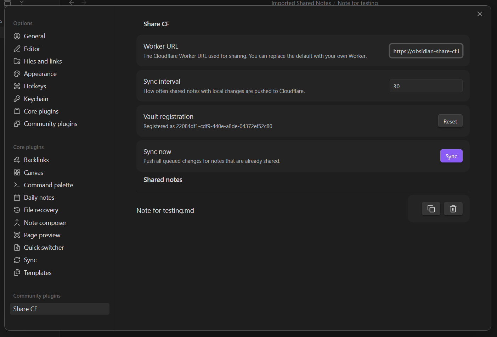
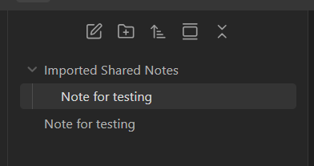
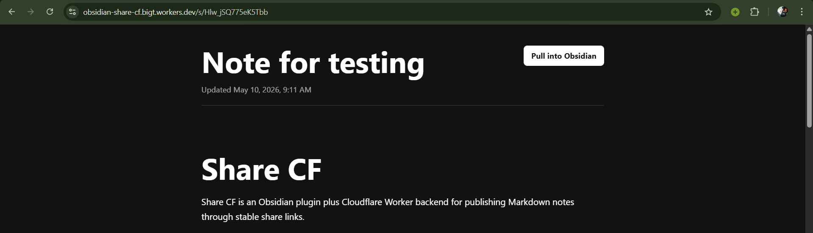

# Obsidian Share CF

Share CF is an Obsidian plugin plus Cloudflare Worker backend for publishing Markdown notes through stable share links.

The client side does not require accounts. After a Worker URL is configured, the plugin automatically registers the vault on first share, stores a local bearer token in plugin data, and keeps one remote note instance per shared Obsidian file. Sharing the same file again returns the same public link, and later changes are pushed to that link.

Created by [BigT](https://github.com/nurtasin).

## Screenshots







## Architecture

- Obsidian plugin: `main.ts`
- Worker API and public renderer: `worker/src/index.ts`
- Metadata database: Cloudflare D1
- Current note body storage: Cloudflare R2

Each shared file receives a stable local `noteId`. D1 stores `vault_id`, `note_id`, `share_id`, path/title/hash metadata, and the R2 object key. R2 stores the current Markdown body at `notes/{vaultId}/{noteId}.md`. The public URL `/s/{shareId}` reads the latest R2 object, so updates keep the existing link fresh.

## Local Plugin Development

```bash
corepack pnpm install
corepack pnpm run dev
```

During development, place this repository in an Obsidian test vault under:

```text
.obsidian/plugins/share-cf
```

Enable community plugins, then enable **Share CF**.

## Cloudflare Setup

From `worker/`:

```bash
corepack pnpm install
corepack pnpm --filter obsidian-share-cf-worker exec wrangler d1 create obsidian-share-cf
corepack pnpm --filter obsidian-share-cf-worker exec wrangler r2 bucket create obsidian-share-cf-notes
```

Update `worker/wrangler.jsonc` with the D1 `database_id`. If you deploy behind a custom domain, set `PUBLIC_BASE_URL` to that origin; otherwise leave it empty and the Worker request origin is used.

Apply the schema:

```bash
corepack pnpm --filter obsidian-share-cf-worker run db:migrate:remote
```

If you are upgrading an existing deployment, make sure the `0002_note_assets.sql` migration has run. It adds the asset metadata table used to track images referenced by shared notes.

Run locally:

```bash
corepack pnpm --filter obsidian-share-cf-worker run dev
```

Deploy:

```bash
corepack pnpm --filter obsidian-share-cf-worker run deploy
```

Copy the deployed Worker URL into **Settings -> Share CF -> Worker URL** in Obsidian.

## Usage

Open a Markdown note and run **Share current note** from the command palette or ribbon icon. The plugin uploads a rewritten copy of the note, copies the share link, and remembers that file. Your original local note is not modified. When a shared note changes, it is queued and synced every 30 minutes by default. You can run **Sync shared notes now** at any time.

Image embeds are uploaded separately to R2. Share CF supports Obsidian wiki embeds like `![[image.png]]` and standard Markdown embeds like ``. Uploaded image objects receive randomized UUID filenames to avoid collisions, and the public copy of the Markdown is rewritten to reference those R2-backed image URLs. If an image is removed from the note, the next sync removes the no-longer-used image from R2.

Public share pages include a **Pull into Obsidian** button. When clicked, Obsidian imports the Markdown into `Imported Shared Notes/`. Clicking the same import link again updates the imported copy instead of creating another duplicate.

Pulled notes include their images. Images are downloaded into `Imported Shared Notes/_assets/{shareId}/`, and the imported Markdown is rewritten to use those local image files. Running **Sync shared notes now** also pulls the latest server copy for imported shared notes, so recipients can manually refresh notes and images after the uploader syncs changes. The settings panel lists pulled documents and automatically removes a pulled document from the local sync list if its local file has been deleted.

Deleting a local note removes only the local tracking entry. Use the Share CF settings tab to disable an existing public link.

## API

- `POST /api/register`: creates a vault registration and returns a bearer token.
- `POST /api/notes`: creates or updates a note for the authenticated vault.
- `GET /api/notes`: lists active shared notes for the authenticated vault.
- `DELETE /api/notes/:noteId`: disables a share link and deletes the R2 object.
- `GET /api/public/notes/:shareId`: returns the latest public Markdown payload for Obsidian imports.
- `GET /assets/:shareId/:assetId`: serves an uploaded image asset for a public shared note.
- `GET /s/:shareId`: renders the latest public note.

## Security Notes

This avoids client-side account creation, but the plugin still needs a trusted Worker URL. Treat the plugin's generated bearer token as secret because it can update or delete shares for that vault. Public links are unguessable random IDs, but anyone with the link can read the note.
